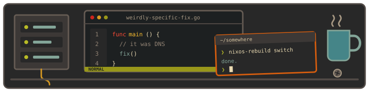
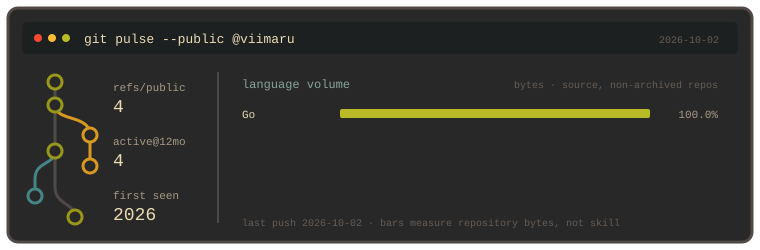

<p align="center">
  
</p>

```text
       \  |  /          viimaru
     `. \ | / .´        ------------------
   ---  \ * /  ---      os       nixos / linux
     .´ / | \ `.        editor   neovim
       /  |  \          code     go · rust · php · c
          |             habitat  terminal / servers
```

I make things I want to use. The rest is probably configuration.

[`~/repos`](https://github.com/viimaru?tab=repositories) · [`./workbench.svg`](./assets/workbench.svg)



<!-- if it works, resist the urge to reconfigure it -->
